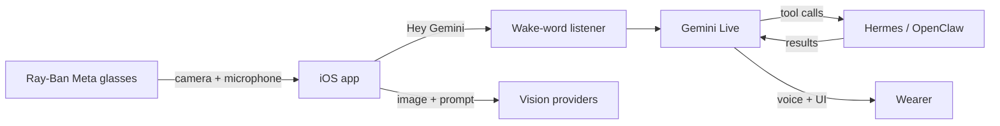

# Super Meta

### A hands-free, Gemini-powered copilot for Ray-Ban Meta glasses.

**See the moment. Ask naturally. Act through your agent.**

[](#requirements)
[](#architecture)
[](#the-experience)
[](#requirements)

Built for the [Google DeepMind Bangalore Hackathon](https://cerebralvalley.ai/e/google-deepmind-bangalore-hackathon/details), Super Meta turns the glasses camera, microphone, and a personal agent into one continuous interface. Say **"Hey Gemini"**, look at the world, and keep moving.

> `Super Meta` is a development codename. "Meta" is a trademark of Meta Platforms; rename the project before public distribution.

## Story

Meta's default Llama experience did not meet the bar for accuracy, speed, or depth of knowledge. I wanted my glasses to feel less like a novelty assistant and more like an always-available interface to the best models and the tools I already use.

So I reverse-engineered the integration path and brought **Gemini Live** into the glasses experience. Then I connected **my Hermes agent**, turning a voice-and-vision assistant into an interface that can understand context and take action.

Now the glasses can do much more than answer a question:

| Ask | What Super Meta can do |
| --- | --- |
| **"What were the key points from my last meeting?"** | Recall and summarize meeting context through Hermes. |
| **"What's the best way to get there?"** | Find and explain the best available route to a destination. |
| **"Handle this for me."** | Control Hermes to carry out an open-ended range of connected agent tasks. |

## The Experience

| Moment | What happens |
| --- | --- |
| **Hands-free live help** | "Hey Gemini" starts a Gemini Live conversation with voice and optional glasses-camera context. |
| **Look, then understand** | Capture a scene for quick recognition, open-ended visual Q&A, or food and nutrition analysis. |
| **Talk across languages** | Run speech-to-speech live translation across 11 languages. |
| **Put an agent in the loop** | Pair Hermes so the assistant can run tasks, send messages, recall context, and report status. |
| **Keep a record** | Vision results are stored locally with SwiftData. |
| **Broadcast what you see** | Stream the glasses camera over RTMP to YouTube, Twitch, or a custom endpoint. |

The iOS home is deliberately focused on **Live AI**, connection, and records. Supporting features remain available through their existing routes and Siri shortcuts.

## Why It Feels Different

Most assistants wait for a prompt. Super Meta is designed around the moment before a prompt exists: the thing in front of you, the context from your day, the task you are already doing, and the answer or action you need without pulling out your phone.



## Architecture

```text
ios/
├── App/                         SwiftUI application and feature screens
│   ├── Sources/Core/             session, wake word, routing, persistence
│   ├── Sources/Features/         Live AI, vision, translation, gateway, RTMP
│   └── Sources/Home/             focused home experience
└── Packages/
    ├── AIProviders/              Gemini, OpenAI, Anthropic, OpenRouter vision clients
    ├── GlassesKit/               Meta Wearables DAT integration
    ├── RealtimeVoice/            Gemini Live and OpenAI Realtime clients + audio
    ├── AgentGateway/             OpenClaw / Hermes WebSocket node client
    └── DesignSystem/             NEURA visual system and shared components
```

### Core stack

- **SwiftUI + Swift 6** for a native, responsive iOS experience.
- **Meta Wearables DAT SDK** for Ray-Ban Meta registration, camera, and device state.
- **Gemini Live** as the default low-latency voice runtime.
- **Gemini, OpenAI, Anthropic, and OpenRouter** for selectable vision workflows.
- **Hermes / OpenClaw** for agentic actions over a paired gateway.
- **SwiftData** for on-device vision history and **HaishinKit** for RTMP streaming.

## Get Running

### Requirements

- macOS with **Xcode 16+** and the iOS 17 SDK
- **XcodeGen**: `brew install xcodegen`
- An iPhone running **iOS 17+**
- Ray-Ban Meta glasses with firmware v20+ and DAT SDK Preview Mode for glasses features
- A Gemini API key for Live AI; provider keys for optional vision features

### 1. Configure local secrets

Create `ios/Config/Secrets.xcconfig`. This file is intentionally ignored by Git.

```xcconfig
DEVELOPMENT_TEAM = YOUR_APPLE_TEAM_ID
META_APP_ID = YOUR_META_APP_ID
CLIENT_TOKEN = YOUR_META_CLIENT_TOKEN
```

Set API keys from the app’s Settings screen. They are stored in the iOS Keychain. The simulator can exercise image workflows through the photo picker, but glasses capture and hands-free audio require a real device.

### 2. Generate and open the project

```sh
cd ios
xcodegen generate
open MetaMod.xcodeproj
```

Select your signing team, choose a connected iPhone, and run the `MetaMod` scheme. The generated `.xcodeproj` is not source-controlled; `project.yml` is the source of truth.

### 3. Verify a build

```sh
xcodebuild \
  -project ios/MetaMod.xcodeproj \
  -scheme MetaMod \
  -destination 'generic/platform=iOS Simulator' \
  CODE_SIGNING_ALLOWED=NO \
  build
```

## Development Notes

### Wake word and realtime voice

The wake listener hands the microphone to Gemini Live when it hears "Hey Gemini," then resumes listening after the session ends. On glasses, this uses the Bluetooth HFP microphone. It is enabled by default and can be changed in Settings.

### Vision providers

Vision features use the provider selected in Settings. Live AI uses Gemini Live. The app intentionally keeps these paths separate so a user can choose the right vision model without changing their realtime voice experience.

### Agent connectivity

Pair a Hermes or OpenClaw endpoint from the Hermes screen. Once connected, Gemini Live can invoke the narrow agent tools exposed by the app, while the glasses remain a node the gateway can query for camera and device status.

## Test Packages

Package tests use real API keys only for optional live checks; tests skip those checks when a key is not present.

```sh
cd ios/Packages/AIProviders && swift test
cd ios/Packages/RealtimeVoice && swift test
cd ios/Packages/AgentGateway && swift test
```

To include live provider checks, supply the appropriate environment variable before running the relevant package test:

```sh
GEMINI_API_KEY=... swift test
OPENAI_API_KEY=... swift test
```

## Project Layout

`ios/` is the native product. `android/` contains a separate React Native/Expo implementation and is not part of the iOS build.

## License and Trademarks

This repository does not grant rights to Meta Platforms, Ray-Ban, Google, Gemini, OpenAI, Anthropic, OpenRouter, OpenClaw, or Hermes trademarks, SDKs, or services. Follow each provider’s terms and the Meta Wearables DAT program requirements before shipping.
